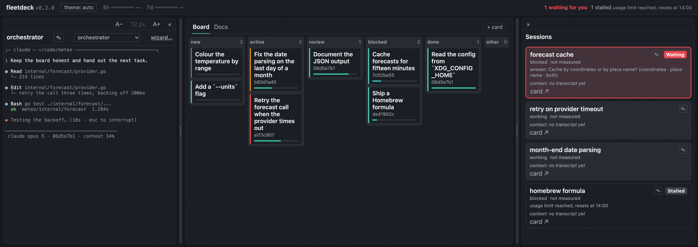
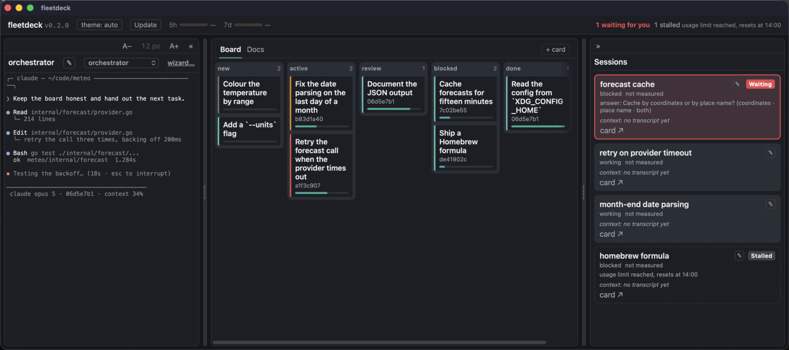

# fleetdeck

[Русская версия](README.ru.md)

One window for a fleet of Claude Code background sessions: what each is doing, the board they share, and the notes around it.



## What it is

Run more than two or three background sessions and you start losing them. One stops to ask something and nobody notices for an hour. Reading what another is doing means squinting at a terminal full of spinners.

fleetdeck watches the sessions and a markdown kanban board together, on one local page. A card and its session are linked by one field, `session`. Nothing else passes between them. You can type into a session from the page, and keep its terminal open next to the board.

One panel serves several fleets, switched the way an IDE switches projects.

macOS only, and it talks to the Claude Code daemon on your own machine — see [limitations](docs/en/limitations.md).

## The app



`fleetdeck.app` is the same panel in a native window. It starts the panel, and starts it again if it stops. It also updates itself from the Update button in its header: a build from a checkout brings that checkout forward, and one installed from a release downloads the next release — after checking that what came down is signed by the same Apple team and notarized by Apple.

## Install

From a release — [the latest one](https://github.com/kroticw/fleetdeck/releases/latest) carries `fleetdeck-<version>-macos.zip`:

1. Unpack it, and drag `fleetdeck.app` into Applications **before** opening it. Opened from Downloads it records a temporary path in Claude Code's settings.
2. Open it from Applications. The setup page takes over from there.

From v0.3.0 the app is signed with an Apple Developer ID and notarized, so macOS asks nothing. Releases before that are unsigned, and macOS will not open one without an exception — [getting started](docs/en/getting-started.md#installing-the-app-from-a-release) walks through it.

From source, with Go 1.27:

```sh
make build            # the binaries, into bin/
./bin/fleetdeck init  # workspace, empty board, Claude Code's statusline
make window-app       # bin/fleetdeck.app
```

`init` looks for the statusline reporter beside the panel binary, so keep the two together. A panel with no configuration asks for a folder and makes the board itself, which makes `init` optional. [Getting started](docs/en/getting-started.md) has the whole flow.

## Build and test

```sh
make build     # every binary under cmd/* into bin/
make test      # go test ./... -race -count=1
make test-web  # the frontend's tests, under node's own runner
make lint      # go vet, gofmt -l, golangci-lint run
```

`make test` stays Go-only, so a checkout without node still gets a complete Go check. CI runs both.

## Documentation

- [Getting started](docs/en/getting-started.md) — installing, first launch, and linking a card to a session.
- [Configuration](docs/en/configuration.md) — every key, its default, and what a wrong value does.
- [Board convention](docs/en/board-convention.md) — the card format and who writes which field.
- [Orchestrating a fleet](docs/en/orchestrator.md) — the working order for the session that runs the others.
- [Limitations](docs/en/limitations.md) — what fleetdeck does not do, and what it reads on your machine.
- [Packages](docs/engineering/packages.md) — what each Go package is for.
- [`docs/engineering/`](docs/engineering) — field notes for whoever changes the code.

## License

Apache 2.0 — see [LICENSE](LICENSE).
