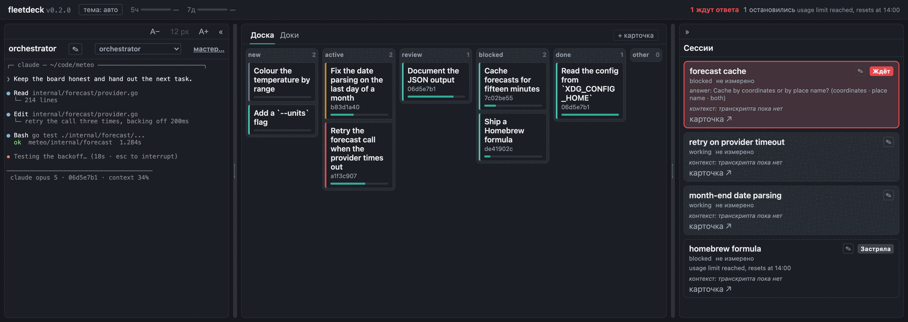
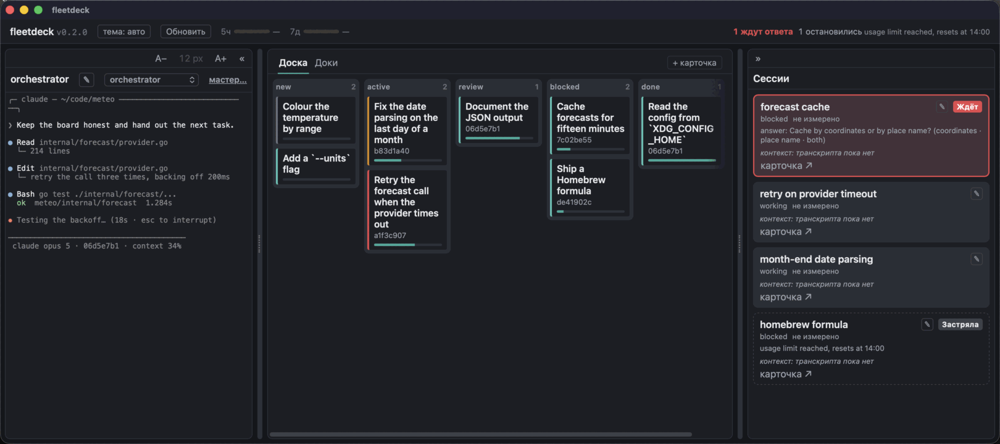

# fleetdeck

[English version](README.md)

Одно окно для флота фоновых сессий Claude Code: чем занята каждая, доска общей работы и заметки вокруг неё.



## Что это

Заведите больше двух-трёх фоновых сессий — и начнёте их терять. Одна остановилась и ждёт ответа, а этого час никто не заметил. Чтобы понять, чем занята другая, приходится вглядываться в терминал со спиннерами.

fleetdeck держит сессии и markdown-доску вместе, на одной локальной странице. Карточку и сессию связывает одно поле, `session`. Больше между ними ничего не ходит. Со страницы можно писать в сессию и держать её терминал открытым рядом с доской.

Один пульт обслуживает несколько флотов — они переключаются, как проекты в IDE.

Только macOS, и общается он с демоном Claude Code на вашей же машине — см. [ограничения](docs/ru/limitations.md).

## Приложение



`fleetdeck.app` — тот же пульт в родном окне. Оно запускает пульт и поднимает заново, если тот остановился. Ещё оно обновляет себя кнопкой «Обновить» в шапке: сборка из клона подтягивает этот клон, а установленная из выпуска скачивает следующий выпуск — предварительно проверив, что скачанное подписано той же командой Apple и нотаризовано Apple.

## Установка

Из выпуска — в [последнем](https://github.com/kroticw/fleetdeck/releases/latest) лежит `fleetdeck-<версия>-macos.dmg`:

1. Откройте его. Появится окно: слева приложение, справа ярлык «Программы» — перетащите приложение на ярлык. Открытое прямо из «Загрузок», оно запишет в настройки Claude Code временный путь.
2. Откройте из «Программ». Дальше работу принимает страница настройки.

В выпуске лежит и `fleetdeck-<версия>-macos.zip` с тем же приложением — это то, что установленная копия скачивает себе по кнопке «Обновить».

Начиная с v0.3.0 приложение подписано Apple Developer ID и нотаризовано, а у образа диска своя подпись и свой тикет, поэтому macOS ничего не спрашивает. Выпуски до этого не подписаны, и macOS не откроет такой без исключения в настройках — как именно, написано в [начале работы](docs/ru/getting-started.md#установка-приложения-из-выпуска).

Из исходников, с Go 1.27:

```sh
make build            # бинари, в bin/
./bin/fleetdeck init  # рабочая папка, пустая доска, статусная строка Claude Code
make window-app       # bin/fleetdeck.app
```

`init` ищет репортёр статусной строки рядом с бинарём пульта — держите их вместе. Пульт без конфигурации сам спросит папку и создаст доску, поэтому `init` не обязателен. Весь порядок действий — в [начале работы](docs/ru/getting-started.md).

## Сборка и тесты

```sh
make build     # все бинари из cmd/* в bin/
make test      # go test ./... -race -count=1
make test-web  # тесты фронтенда, в родном раннере node
make lint      # go vet, gofmt -l, golangci-lint run
```

`make test` гоняет тесты Go, а через них и Python-тесты доски, поэтому ему нужен `python3`, и без него он отказывает словами. node ему не нужен: в окружении без node всё остальное проверяется полностью. CI гоняет и то и другое.

## Документация

- [Начало работы](docs/ru/getting-started.md) — установка, первый запуск и связывание карточки с сессией.
- [Конфигурация](docs/ru/configuration.md) — каждый ключ, его значение по умолчанию и что будет, если задать его неверно.
- [Конвенция доски](docs/ru/board-convention.md) — формат карточки и кто какое поле пишет.
- [Оркестрация флота](docs/ru/orchestrator.md) — рабочий порядок для сессии, которая ведёт остальные.
- [Ограничения](docs/ru/limitations.md) — чего fleetdeck не делает и что читает на вашей машине.
- [Пакеты](docs/engineering/packages.md) — зачем нужен каждый пакет Go. На английском.
- [`docs/engineering/`](docs/engineering) — заметки для того, кто меняет код. На английском.

## Лицензия

Apache 2.0 — см. [LICENSE](LICENSE).
