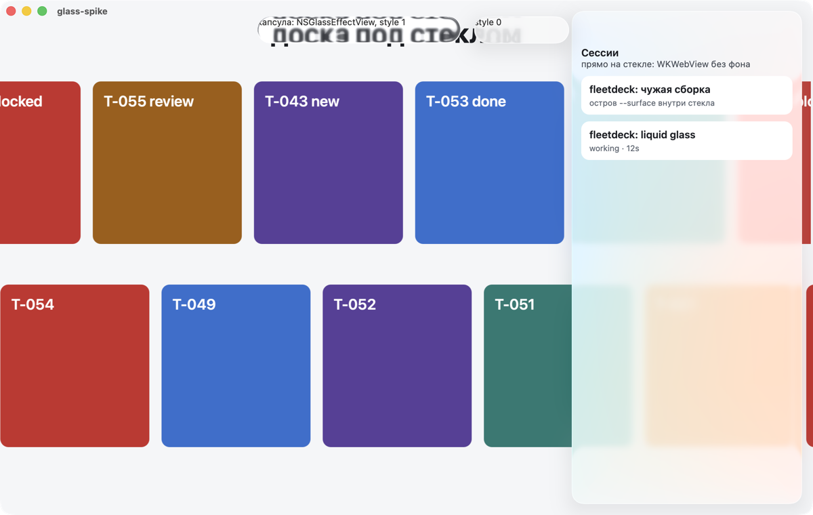
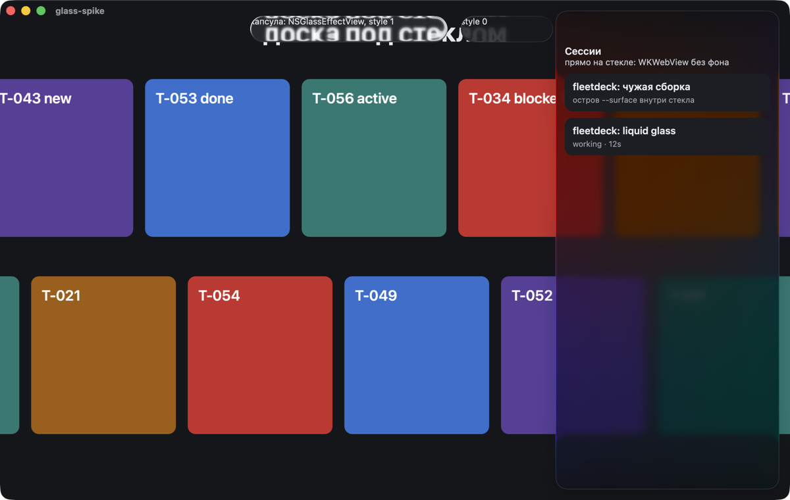

# fleetdeck: окно с жидким стеклом — дизайн

**Дата:** 2026-09-14. **Карточка:** T-056. **Статус:** черновик на ревью оркестратора; оператору показывается после ревью.

**Основа:** `origin/master` c0ea864. Выбор оператора сделан на канвасе этапа 1 и записан в лог карточки: главный экран **E**, карточка **K1**, сессия **S1**, доки **Д1**. Канвас: <https://claude.ai/code/artifact/58087272-77e7-4f12-993d-054d56a5e007>, страница «Выбрано».

## 1. Что строим

Окно fleetdeck в стиле macOS 26: доска занимает всё окно, колонка оркестратора и колонка сессий плавают над ней стеклянными панелями, вкладки, «+ карточка», тема и лимиты — стеклянные капсулы. Доска прокручивается под панелями, и стекло её преломляет. Всё, что читают — карточки, строки сессий, терминалы, документы, — лежит на непрозрачных островах. Фон под доской сплошной.

Карточка (K1), сессия (S1) и документ из карточки открываются листом над затемнённой доской между панелями. Раздел доков (Д1) — два острова, список и документ, на месте доски.

Стекло — системный материал `NSGlassEffectView`, не `backdrop-filter` и не картинка.

### 1.1 Что нельзя сломать

Из карточки T-056, дословно по смыслу:

- macOS ниже 26 и включённую «Уменьшить прозрачность»: окно выглядит правильно и без стекла;
- читаемость терминала, карточек и заголовков поверх стекла в обеих темах;
- механизм обновления из выпуска, передачу панели и проверку подписи.

Страница в обычной вкладке браузера больше не поддерживается как продукт (T-017), но панель её отдаёт. Дизайн сохраняет её рабочей в нынешнем виде, потому что это бесплатно (раздел 5.3), и не обещает большего.

### 1.2 Границы

Не входит в эту работу:

- стекло внутри веб-содержимого (приватное CSS-свойство WebKit `-apple-visual-effect`: закрытый API);
- перенос раскладки на Linux: окно `cmd/fleetdeck-window` существует только под darwin;
- новые функции панели. Меняются только раскладка, поверхности и то, где живёт каждый элемент.

## 2. Предусловие: окно уже не запускается на macOS ниже 26

Замерено 2026-09-14 на установленном v0.9.1, чтением метаданных, без запуска:

| Бинарник | Срезы | `LC_BUILD_VERSION minos` | SDK |
| --- | --- | --- | --- |
| `Contents/MacOS/fleetdeck-window` | arm64, x86_64 | **26.0** | 26.5 |
| `Contents/MacOS/fleetdeck` | arm64, x86_64 | 13.0 | 26.2 |

В `Info.plist` при этом `LSMinimumSystemVersion = 11.0`. Ни `-mmacosx-version-min`, ни `MACOSX_DEPLOYMENT_TARGET` нигде не заданы (`Makefile`, `scripts/`, workflow). Для cgo clang берёт версию системы раннера, выпуск собирается на `macos-latest`, и dyld не загрузит окно на macOS 15.

Оркестратор перепроверил и завёл **T-058** «окно не запускается на macOS ниже 26». Она стартует после мержа T-057 и выбирает нижнюю версию сама — не ниже 13.0, граница Go 1.27. Для этого дизайна T-058 — **предусловие**: всё, что ниже написано про macOS ниже 26, проверяемо только на сборке окна после T-058.

## 3. Спайк: стекло над WKWebView

Выбрасываемая программа `spike/glass-spike.c` в папке спеки: чистый C поверх Objective-C runtime, тем же способом, каким `cmd/fleetdeck-window` вызывает AppKit, без `.m` и без режима Objective-C. Голый бинарник, не бандл; порт 7777, `/Applications` и настоящая панель не трогались. Страницы — встроенный HTML через `loadHTMLString:`. Программа сама снимает своё окно `screencapture -l` и закрывается через 6,6 с.

Устройство окна в спайке — ровно то, что предлагает этот дизайн:

1. `WKWebView` на всё окно — «доска» с двумя рядами карточек, которые непрерывно едут по горизонтали;
2. над ней соседним видом `NSGlassEffectView` — «колонка сессий», у которой `contentView` — второй `WKWebView` с `drawsBackground = NO`;
3. две капсулы `NSGlassEffectView` со `style` 1 и 0 и подписью `NSTextField`.

Результат на macOS 26.6.2 (25G83), «Уменьшить прозрачность» выключено:

- **Стекло над веб-видом видит веб-содержимое.** Под панелью размыты карточки доски, в обеих темах.
- **Стекло обновляется, регрессии 26.2 нет.** Доля пикселей, изменившихся больше чем на 8/255 между кадрами с интервалом 0,9 с:

  | Область | Светлая | Тёмная |
  | --- | --- | --- |
  | под стеклом, над едущими карточками | 62,8 % | 79,5 % |
  | открытая доска, контроль | 69,9 % | 78,0 % |
  | под стеклом после сдвига окна на (+160, −60) | 86,3 % | 99,0 % |

  Под стеклом меняется столько же, сколько на открытой доске: кэшированного фона, описанного на форуме Apple (тред 810314) для 26.2, здесь нет. Тот случай — стекло без окна за ним, сэмплирующее чужие окна; этот дизайн стеклом за окно не смотрит.
- **Прозрачный `WKWebView` как `contentView` стекла работает.** Текст прямо на стекле читается; непрозрачные острова внутри него — тоже.
- **`style` 1 — Clear, `style` 0 — Regular.** Clear работает как линза и искажает текст доски под капсулой до нечитаемого (видно на снимках). Капсулам и панелям нужен **Regular**.
- **Не проверено спайком:** «Уменьшить прозрачность» (системную настройку оператора не переключали), macOS ниже 26, полный экран, `BroadcastChannel` между веб-видами (дизайн на него не опирается).

Исходник и снимки лежат в папке спеки как свидетельство; в сборку они не входят.

## 4. Подходы

### 4.1 Рассмотренные

**А. Свои стеклянные панели над веб-видом доски (выбран).** Одно `NSWindow`. Веб-вид доски — нижний слой на всё окно. Над ним `NSGlassEffectContainerView` с двумя `NSGlassEffectView`, у каждого свой прозрачный `WKWebView`, и капсулы из системных контролов в стекле. Раскладку, отступы, радиусы и поведение задаём сами.

- За: ровно вид E; проверено спайком на 26.6.2; на macOS ниже 26 та же геометрия с `NSVisualEffectView` вместо стекла; веб остаётся одним приложением.
- Против: ширину и сворачивание панелей, отступы доски и полный экран ведём сами.

**Б. Системный `NSSplitViewController`: sidebar, content, inspector.** В macOS 26 боковые панели split view сами становятся плавающим стеклом, а содержимое уходит под них через safe area.

- За: меньше своего кода для стекла и перетаскивания разделителей.
- Против: вид и поведение задаёт AppKit, а не E — отступы панелей от краёв окна, скругления, полоса свёрнутой колонки сессий шириной 48 px с метками; нынешнее перетаскивание и сворачивание колонок (`columnresize.js`, `columnwidth.js`) переписываются на разделители split view; поведение inspector в 26 и вид sidebar ниже 26 спайком не проверены. Проверить можно только вторым спайком.

**В. Одна страница, стекло по прямоугольникам DOM.** Веб-вид один, нативные стеклянные виды ставятся над ним по координатам, которые сообщает страница.

- Отвергнут: текст колонок остаётся в той же странице **под** стеклом и размывается вместе с доской. Годится только для пустых форм, а не для панелей с содержимым.

### 4.2 Решение

Подход **А**. Если оркестратор или оператор хочет сравнить с **Б** на деле, это второй спайк, и он требует отдельного разрешения.

## 5. Устройство окна

### 5.1 Слои

Снизу вверх внутри `contentView` окна:

| Слой | Вид | Что показывает | Кто создаёт |
| --- | --- | --- | --- |
| 1 | `WKWebView` доски | доска, лист K1/S1, доки Д1, страницы запуска и мастера | `webview_go` (`w`), как сейчас |
| 2 | `NSGlassEffectContainerView` | объединяет стекло панелей и капсул | окно, C |
| 2.1 | `NSGlassEffectView`, Regular, радиус 18 | колонка оркестратора | окно, C |
| 2.1.1 | `WKWebView` без фона | страница поверхности `orchestrator` | окно, C |
| 2.2 | `NSGlassEffectView`, Regular, радиус 18 | колонка сессий | окно, C |
| 2.2.1 | `WKWebView` без фона | страница поверхности `sessions` | окно, C |
| 2.3 | `NSGlassEffectView`, Regular, капсулы | вкладки, «+ карточка», тема, лимиты | окно, C |

`webview_go` кладёт свой `WKWebView` прямо в `contentView` окна (`webview.h`, `setContentView:`). Окно после `webview.New` ставит вместо него простой `NSView` на всё окно и возвращает веб-вид доски первым подвидом. Указатель на веб-вид доски берётся как `[window contentView]` до замены: обёртка Go его не отдаёт.

### 5.2 Геометрия

Числа — из макета E, в точках:

- панели отстоят от краёв окна на 8; ширина колонки оркестратора по умолчанию 368, колонки сессий 348; свёрнутая колонка сессий — 48;
- ряд капсул: сверху 12, высота 32, между панелями: 10 от левой и 12 от правой;
- доска получает отступы: слева — правый край левой панели плюс 18, сверху 64, справа 0 — последняя колонка уходит под панель сессий. Отступы окно сообщает странице доски (раздел 6.2), страница применяет их CSS-переменными;
- кнопки окна (светофоры) AppKit рисует поверх содержимого; верхняя строка колонки оркестратора оставляет под них место слева.

Окно включает `NSWindowStyleMaskFullSizeContentView` и `titlebarAppearsTransparent`: содержимое идёт под заголовок, заголовок не рисуется, светофоры остаются.

### 5.3 Граница нативного слоя и веба

Правило: **нативный слой отвечает за раму, веб — за содержимое.** Нативный слой не знает, что такое карточка, сессия или лимит; веб не знает, где стекло.

Нативный слой (`cmd/fleetdeck-window`, C и Go):

- создаёт виды, стекло или его замену, капсулы;
- держит геометрию: ширину и сворачивание панелей, отступы, полный экран;
- переносит вызовы между поверхностями (раздел 6.2);
- решает, показывать ли панели вообще (раздел 5.5);
- слушает «Уменьшить прозрачность», системную тему и выбранную тему.

Веб (`web/`):

- рисует всё содержимое, как сейчас, одним набором модулей;
- одна страница `index.html`; какую поверхность смонтировать — `board`, `orchestrator` или `sessions`, — страница узнаёт из объекта `window.fleetdeckHost`, который окно подмешивает скриптом до загрузки (раздел 6.1). Нет объекта — нынешняя раскладка из трёх колонок, как в браузере сегодня;
- сообщает окну модель капсул (подписи, выбранная вкладка, значения лимитов), свою ширину колонки и открываемое;
- принимает от окна: отступы, режим стекла, тему, команды «открыть».

Так `web/` остаётся одним приложением: те же модули, те же стили, тот же словарь. Поверхность — это только выбор, какие части страницы смонтировать (`main.js`) и какой набор правил CSS включить (`data-surface` и `data-glass` на `<html>`).

### 5.4 Капсулы

Капсулы — системные контролы AppKit внутри `NSGlassEffectView`, а не веб-вид.

| Капсула | Контрол | Откуда подписи и состояние | Действие |
| --- | --- | --- | --- |
| Доска / Доки | `NSSegmentedControl` | страница доски: подписи из словаря, выбранная вкладка | окно вызывает у доски `show("board" \| "docs")` |
| + карточка | `NSButton` | страница доски | окно вызывает у доски `newCard()`; форма открывается в странице доски под рядом капсул |
| тема | `NSButton` | страница доски: подпись «тема: авто» и т. п. | окно переключает тему во всех поверхностях (раздел 7.4) |
| 5ч, 7д | `NSView` с подписью и `NSLevelIndicator` | страница доски: подпись, процент, уровень `cool`/`warm`/`hot`/`stale`/`off` | нет |

Почему не четвёртый веб-вид для ряда капсул: текст капсул должен лежать над стеклом, а прозрачный веб-вид над стеклом перехватывает щелчки по всей своей площади, в том числе по карточкам доски в промежутках между капсулами. Почему не `NSToolbar`: он ставит капсулы в строку заголовка на всю ширину окна и опускает панели ниже неё; это не E.

Цвет уровня лимита — те же токены: окно получает от страницы готовые цвета (`--ok`, `--attn`, `--danger`, `--text-muted` в текущей теме), а не хранит свою палитру.

### 5.5 Когда панелей нет

Панели и капсулы видны только когда страница доски сообщила режим `panel`. До этого и в остальных случаях окно показывает один веб-вид доски на всё окно, как сегодня:

- собственные страницы окна: пустая, «запускаю панель», «заменяю панель», «панель не запустилась» (`owner.go`, `SetHtml`);
- `start.html` и `setup.html`: выбор флота и мастер;
- страница доски, открытая не из окна.

Режим сообщает сама страница доски после загрузки. Окно ничего не угадывает по адресу. Когда панель пропадает (перезапуск, передача), веб-виды поверхностей показывают своё «нет связи», как сегодня страница; окно их не перезагружает.

## 6. Три веб-вида и одна панель

Опирается на `origin/master` c0ea864: `internal/server` (`server.go`, `guard.go`, `ws.go`, `pty.go`, `static.go`), `web/js/main.js`, `buildcheck.js`, `theme.js`, `columnwidth.js`, `columnresize.js`, `sessions.js`, `fleet.js`.

### 6.1 Адреса и поверхность

- Все три веб-вида открывают **один и тот же адрес панели** — тот, на котором стоит доска: `http://127.0.0.1:7777/?fleet=<флот>`. Сервер по-прежнему решает сам: с ключом `fleet` отдаёт `index.html`, без него — `start.html`, до настройки — страницу мастера (`static.go`, `setup.go`).
- Поверхность задаёт не адрес, а окно: каждому веб-виду до загрузки подмешивается скрипт (`WKUserScript`, начало документа), который ставит `window.fleetdeckHost = { version: 1, surface: "board" | "orchestrator" | "sessions", glass: "glass" | "vibrancy" | "opaque" }`. `main.js` читает его и монтирует только свою часть страницы.
- Флот у трёх видов один. Доска сообщает окну режим `panel` вместе со своим `fleet`, и окно открывает поверхности ровно на этом флоте. Сервер флот не хранит (`api.go`: «флот живёт в адресе вкладки»), поэтому расхождение ничем, кроме этого правила, не ловится.
- Смена флота из любой поверхности (`.fleet-other`, меню флота) идёт не через `location.assign` в своём виде, а через окно: доска переходит на новый адрес, поверхности уничтожаются и создаются заново после её отчёта.
- Проверка Origin (`guard.go`) пропускает локальный адрес с любым портом, а поверхности открывают настоящие адреса панели — их запросы и сокеты проходят её так же, как страница сегодня. Терминал, как и сейчас, берёт токен `/api/terminal-token` на каждый сокет; токен общий для процесса панели.
- CSP (`script-src 'self'`) скриптов окна не касается: `WKUserScript` — не содержимое страницы. Это уже используется уведомлением #160.

**Совместимость со страницей чужой сборки.** Панель на порту может быть старше или новее окна (#160). Режим `panel` страница включает сама. Старая страница его не сообщит, и окно покажет её одним веб-видом на всё окно — в её собственной раскладке. Неизвестную `version` окно тоже принимает за «не сообщила». Согласования версий не нужно.

### 6.2 Мост

Сегодня мост — восемь привязок `w.Bind` в одном веб-виде `webview_go`. Поверхности получают те же имена:

- в Go — один реестр привязок: имя → обработчик. `w.Bind` для доски и обработчик сообщений поверхностей берут обработчики из него, поэтому каждая привязка пишется один раз;
- у каждой поверхности свой `WKUserContentController` с обработчиком сообщений `fleetdeck`. Класс обработчика создаётся в рантайме из C так же, как это делает `webview.h` и `menu_darwin.c` (`objc_allocateClassPair`, `class_addMethod`). Скрипт начала документа объявляет те же глобальные функции (`window.fleetdeckReload` и остальные), возвращающие `Promise`; ответ окно отдаёт через `evaluateJavaScript:`;
- существующие контракты имён (`reload_test.go` и соседние тесты) остаются в силе.

Новые вызовы, страница → окно:

| Вызов | Кто вызывает | Что окно делает |
| --- | --- | --- |
| `fleetdeckLayout({ version, mode, fleet })` | доска | `panel` — создаёт поверхности и показывает раму; `plain` — убирает их |
| `fleetdeckOpen({ kind: "card", path })` | оркестратор, сессии | передаёт доске: открыть лист K1 |
| `fleetdeckOpen({ kind: "doc", path })` | оркестратор, сессии | передаёт доске: открыть документ |
| `fleetdeckOpen({ kind: "session", short })` | сессии, оркестратор | передаёт доске: открыть лист S1; переводит фокус в веб-вид доски |
| `fleetdeckOpen({ kind: "orchestrator" })` | доска | открывают закреплённую сессию оркестратора: окно переводит фокус в поверхность оркестратора и шлёт ей `focusTerminal` (раздел 6.3) |
| `fleetdeckSwitchFleet(name)` | любая | доска переходит на `/?fleet=<name>` |
| `fleetdeckCapsules(model)` | доска | обновляет подписи, выбранную вкладку, лимиты и их цвета |
| `fleetdeckTheme(choice)` | доска | рассылает тему поверхностям, ставит `appearance` окну |
| `fleetdeckPanel({ side, folded })` | оркестратор, сессии | сворачивает или разворачивает панель |
| `fleetdeckReload()` | любая (уже есть) | перезагружает все три вида, доску — навигацией, как сейчас |

Окно → страница — одна функция `window.fleetdeckHost.receive(message)`, сообщения:

| `type` | Кому | Поля |
| --- | --- | --- |
| `open` | доска | `kind`, `path` или `short` |
| `show` | доска | `section`: `board` или `docs` |
| `newCard` | доска | — |
| `cycleTheme` | доска | — |
| `theme` | оркестратор, сессии | `choice` |
| `insets` | доска | `top`, `left`, `right` в точках |
| `glass` | все | `glass`, `vibrancy` или `opaque` |
| `folded` | оркестратор, сессии | `folded` |
| `focusTerminal` | оркестратор | — |
| `fullscreen` | оркестратор | `on`: верхняя строка убирает или возвращает место под светофоры (раздел 7.3) |

Неизвестный `type` страница пропускает.

### 6.3 Сокеты и терминалы

- Три снимочных сокета `/ws` вместо одного. Сервер раздаёт закэшированный снимок только на чтение, по горутине и тикеру на соединение (`ws.go`); ограничений на число клиентов нет. Цена — втрое больше JSON в секунду по петле; размер снимка на живом флоте мерится на стенде части Б.
- Терминал оркестратора живёт в поверхности `orchestrator`, терминал открытой сессии — в листе S1 доски. Два подключения к одной сессии на macOS работают одновременно (`daemon-control-socket.md`), но размер терминала общий, и последний, кто его задал, навязывает его остальным.
- Поэтому открыть S1 для **закреплённой сессии оркестратора** (ссылкой из карточки или терминала) нельзя: доска вместо листа просит окно `focusTerminal` в поверхности оркестратора. Сегодня тот же конфликт обходится тем, что сессия оркестратора не показана в списке сессий (`sessions.js`).

### 6.4 Состояние страниц

| Что | Сегодня | В трёх видах |
| --- | --- | --- |
| тема | `localStorage` `fleetdeck-theme`, читается при загрузке | хранилище общее (все виды на постоянном хранилище по умолчанию); живую синхронизацию делает окно, раздел 7.4 |
| шрифт терминала | `localStorage` на место | без изменений: ключи и так на место |
| запомненный флот | `localStorage` `fleetdeck-fleet` | пишет только доска |
| ширина и сворачивание колонок | проценты от общего `<main>` в `localStorage` | в окне считать не от чего; ширину в точках и сворачивание хранит окно (`NSUserDefaults` домена приложения). Ключи страницы остаются для раскладки без окна |
| перезагрузка после смены сборки | `sessionStorage`: откуда уходим, флот, открытая сессия, число попыток | `sessionStorage` у каждого вида свой. Машину перезагрузки ведёт только доска; поверхности при `fleetdeckHost` показывают плашку и вызывают `fleetdeckReload`, своих попыток не считают |
| закрытие листа щелчком мимо и Escape | слушатели на `document` | остаются в документе доски. Щелчок в другой поверхности лист не закрывает — так и задумано (раздел 7.5) |
| счётчики «ждут ответа», «остановились» | `header.js` по всему снимку | считаются в поверхности сессий по её снимку |

### 6.5 Страницы без панели

- `start.html` (адрес без `fleet`) и мастер до настройки режима `panel` не сообщают — окно показывает их одним видом на всё окно.
- Перезагрузка окна сегодня уходит на фиксированный `-url`, то есть на `start.html`, и `start.js` возвращается во флот по `takeReloadFleet`. Это делает доска в своём `sessionStorage`, как сейчас; поверхности появятся после её отчёта `panel`.

## 7. Поведение

### 7.1 macOS ниже 26

При условии раздела 2 (окно собрано с нижней версией ниже 26):

- класс ищется строкой: `objc_getClass("NSGlassEffectView")`. `NULL` — значит системы без стекла. Заголовок `NSGlassEffectView.h` не подключается, и своих имён вида `NSGlassEffectViewStyle` в коде нет: на этом споткнулся Wails (#4541);
- вместо стекла — `NSVisualEffectView` с `blendingMode = withinWindow` (размывает доску под собой, а не рабочий стол), материал `sidebar` для панелей и `popover` для капсул, скругление через слой;
- `NSGlassEffectContainerView` не создаётся; панели и капсулы — прямые подвиды корневого вида;
- раскладка, отступы, веб-виды и мост те же.

### 7.2 «Уменьшить прозрачность» и «Увеличить контраст»

Автоматическое поведение `NSGlassEffectView` при этих настройках первичными источниками Apple не описано, поэтому окно ведёт его само:

- при создании читает `[[NSWorkspace sharedWorkspace] accessibilityDisplayShouldReduceTransparency]` и подписывается на `NSWorkspaceAccessibilityDisplayOptionsDidChangeNotification`;
- настройка включена: вместо стекла и `NSVisualEffectView` — простой `NSView` без фона, а поверхностям сообщается режим `opaque`. Страницы в режиме `opaque` сами красят панели `--surface` со скруглением и рамкой `--border`, капсулы — `--surface-raised`. Цвета остаются в CSS, окно их не дублирует;
- в macOS 26 «Увеличить контраст» включает и фиксирует «Уменьшить прозрачность», поэтому отдельной ветки для контраста нет.

### 7.3 Полный экран

Стекло сэмплирует доску, а не рабочий стол, поэтому в полном экране остаётся живым (канвас, страница «Полный экран»). Окно слушает `NSWindowDidEnterFullScreenNotification` и `NSWindowDidExitFullScreenNotification`: светофоры скрыты, левая верхняя строка колонки оркестратора место под них не оставляет; отступы доски пересчитываются и отправляются странице.

### 7.4 Темы

Тема сегодня — выбор страницы (`theme.js`, `data-theme` на `<html>`, запомненный в `localStorage`). В окне с тремя веб-видами:

- выбор хранит по-прежнему страница доски;
- щелчок по капсуле темы — окно вызывает у доски `cycleTheme()`, доска сохраняет выбор и отвечает окну итоговым `auto`/`light`/`dark`;
- окно рассылает тему двум другим поверхностям и ставит окну `appearance`: `NSAppearanceNameAqua`, `NSAppearanceNameDarkAqua` или системный (`nil`) для `auto`. Без этого стекло осталось бы светлым под тёмной страницей при светлой системе — оно следует `effectiveAppearance` вида, а не CSS.

### 7.5 Фокус и клавиатура

- Меню правки (Cmd+X/C/V/A/Z) идёт по цепочке респондеров и работает в том веб-виде, где фокус; менять нечего.
- Cmd+R (`reload:`) сегодня перезагружает только веб-вид с фокусом. Пункт меню переводится на действие окна «перезагрузить все поверхности».
- Cmd+= / Cmd+- / Cmd+0 страница обрабатывает сама — меняется шрифт того терминала, у которого фокус.
- Escape закрывает лист в странице доски, если фокус в ней.
- Открыли сессию из колонки сессий — окно после открытия листа переводит фокус в веб-вид доски, чтобы можно было сразу печатать в терминал. `makeFirstResponder:` у `WKWebView` ненадёжен (WebKit, bug 143482); запасной путь — страница сама фокусирует терминал после команды окна. Проверяется на стенде в части Б.
- Щелчок по другой поверхности лист не закрывает: `mousedown` в другом веб-виде в документ доски не приходит. Это желаемо — можно выбирать сессии в колонке, не закрывая лист.

## 8. Обновление, передача панели, подпись

- **Процесс и бандл те же.** Один `fleetdeck-window`, один бандл, те же подпись Developer ID, hardened runtime и пустые entitlements: дополнительные `WKWebView` и `NSGlassEffectView` прав не требуют.
- **Машина состояний окна не множится.** `screen.on` (`owner.go`) управляет только веб-видом доски, как сейчас. Веб-виды поверхностей создаются, когда доска сообщила режим `panel`, и уничтожаются, когда окно показывает свою страницу (раздел 5.5). У них нет своей навигации в ответ на события keeper. Это важно после T-057: гонки навигации при обновлении чинятся в `screen`, `Takeover` и `canonicalBundle`, и новое устройство не должно добавлять путей навигации.
- **Передача панели новому окну** не меняется: новое окно — отдельный процесс, строит свои веб-виды заново, старое закрывается целиком.
- **Перезагрузка после смены сборки.** `buildcheck.js` в любой поверхности вызывает `fleetdeckReload`; окно перезагружает все три веб-вида одной командой, доску — навигацией на адрес панели, как сейчас (`reloadBinding`), поверхности — на свои адреса.
- **Уведомление о чужой сборке (#160)** остаётся скриптом в веб-виде доски (`w.Init`): нижняя плашка на всю ширину доски, над ней панели. Бренд с версией сборки переезжает в поверхность оркестратора (раздел 9) внутри того же `<header id="header">`, поэтому правило `#header .build-rev::before` не меняется — окно подмешивает его ещё и поверхности оркестратора.
- **Кнопка обновления** переезжает из шапки в верхнюю строку колонки оркестратора. Привязки `fleetdeckUpdateKnown` и `fleetdeckUpdate` доступны в поверхности `orchestrator` через общий мост (раздел 6.2).
- **LaunchServices.** Новых бандлов, идентификаторов и регистраций нет. Стенды части Б запускают голый бинарник или сборку с отдельным идентификатором, как решено в T-057.

## 9. Где что оказывается

| Элемент сегодня | Где в E | Поверхность |
| --- | --- | --- |
| шапка: бренд, версия, меню флота | верхняя строка колонки оркестратора | `orchestrator` |
| шапка: тема | капсула | окно, по модели доски |
| шапка: лимиты 5ч, 7д | капсулы | окно, по модели доски |
| шапка: «ждут ответа», «остановились» | над списком в колонке сессий | `sessions` |
| кнопка обновления | верхняя строка колонки оркестратора | `orchestrator` |
| плашка устаревшей страницы (`#build-banner`) | в каждой поверхности, как сейчас | все |
| колонка оркестратора и терминал | стеклянная панель слева | `orchestrator` |
| вкладки Доска/Доки, «+ карточка» | капсулы; форма новой карточки — в доске | окно + `board` |
| доска | на всё окно под панелями | `board` |
| окно карточки, документа | лист K1 над доской | `board` |
| окно сессии | лист S1 над доской | `board` |
| раздел доков | Д1: список и документ островами | `board` |
| колонка сессий, свёрнутая полоса | стеклянная панель справа; свёрнутая — 48 | `sessions` |
| перетаскивание ширины колонок | край панели, нативно | окно |

## 10. Как проверять

### 10.1 На 26.6.2 у оператора

Стенд части Б — голая сборка окна с отдельным `HOME` и портом, не 7777, по правилам T-057. Проверяется глазами оператора, со снимками:

- обе темы и `auto` при светлой и тёмной системе;
- «Уменьшить прозрачность» — включает оператор;
- полный экран;
- K1, S1, Д1, свёрнутая колонка сессий, перетаскивание ширины;
- печать в терминал листа S1 сразу после открытия из колонки сессий;
- обновление кнопкой на стенде из T-057.

### 10.2 macOS ниже 26

У оператора такой системы нет. Предложения, ничего не разворачивается без решения оператора:

1. **Tart с macOS 15** (`ghcr.io/cirruslabs/macos-sequoia-base`) на этом же Mac: окно запускается в ВМ, оператор смотрит глазами. Цена: ВМ просит 4–8 ГБ памяти, а памяти на машине мало — запускать, когда флот остановлен.
2. **Дымовой прогон в CI** на раннере `macos-15`: сборка окна, запуск с отдельным `HOME` и портом, снимок окна в артефакт, проверка, что процесс жив. Проверку `minos` собранного бинарника добавляет T-058; этот прогон её дополняет запуском. Глаз не заменяет, но ловит «не запускается», которое сегодня в выпуске.

Оба пункта не проверены: ни Tart, ни снимок окна на раннере GitHub на этой работе не пробовались.

## 11. Риски

| Риск | Что делаем |
| --- | --- |
| окно не стартует ниже 26 уже сейчас | предусловие, раздел 2 |
| `makeFirstResponder:` у `WKWebView` ненадёжен | запасной путь через страницу, проверка на стенде |
| регрессия стекла 26.2 вернётся в другой версии | дымовой снимок в CI на `macos-26` сравнивает область под стеклом, как спайк |
| `drawsBackground` — ключ KVC, а не публичное свойство | используется годами; выпуск не через App Store; при отказе ключа веб-вид закрашивает панель — видно на стенде сразу |
| три снимочных сокета и два терминала вместо одного | раздел 6.3 |
| Clear-стекло делает текст под капсулой нечитаемым | только Regular, закреплено тестом на создание вида |
